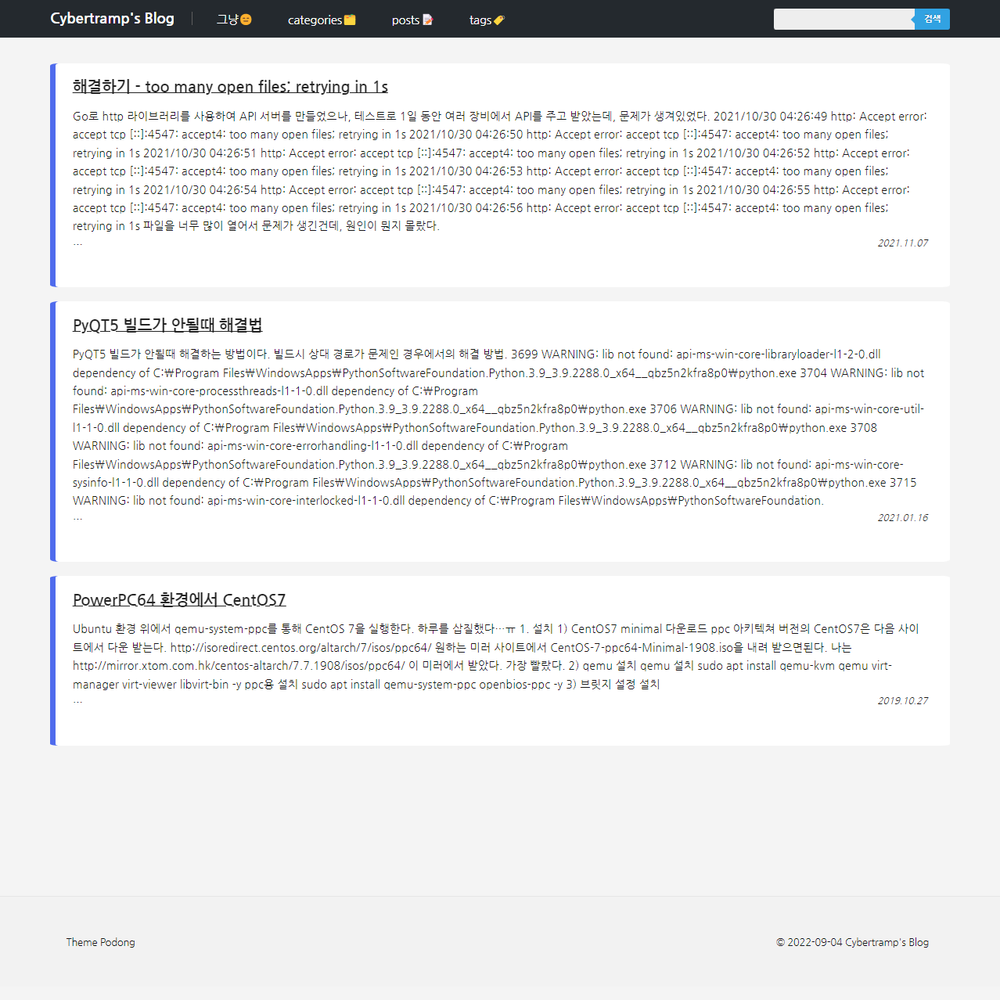

# Hugo Theme - podong
A simple [Hugo](https://gohugo.io/) theme for blog.



## Feature
- Support Menu, categories, tags
- Support Search

## Installation
```bash
git clone https://github.com/cybertramp/hugo-theme-podong.git themes/podong
```

OR

```bash
git submodule add https://github.com/cybertramp/hugo-theme-podong.git themes/podong
```

## config.toml
```toml
baseURL = "https://github.com/cybertramp/hugo-theme-podong"
languageCode = "ko-kr"
title = "podong theme"
theme = 'podong'

[menu]
[[menu.main]]
    identifier = 'box'
    name = 'box'
    url = '/box/'
    weight = -999
[[menu.main]]
    identifier = 'categories'
    name = 'Categories'
    url = '/categories/'
    weight = -110
[[menu.main]]
    identifier = 'posts'
    name = 'Posts'
    url = '/posts/'
    weight = -110
[[menu.main]]
    identifier = 'tags'
    name = 'Tags'
    url = '/tags/'
    weight = -110

[outputs]
  home = ["HTML", "RSS", "JSON"]

```

## LICENSE
[MIT](https://github.com/cybertramp/hugo-theme-podong/blob/main/LICENSE)

## Version History
[v0.0.1]
  - init